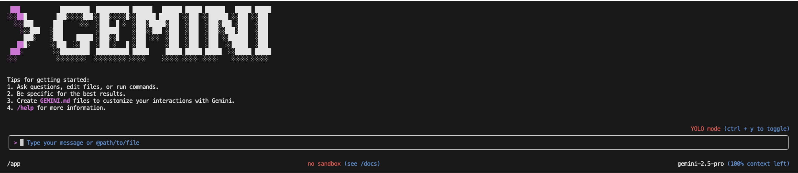
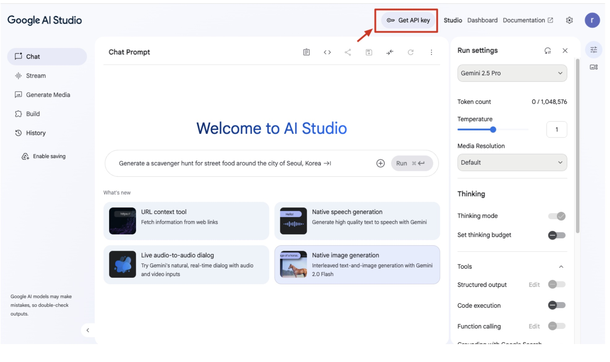
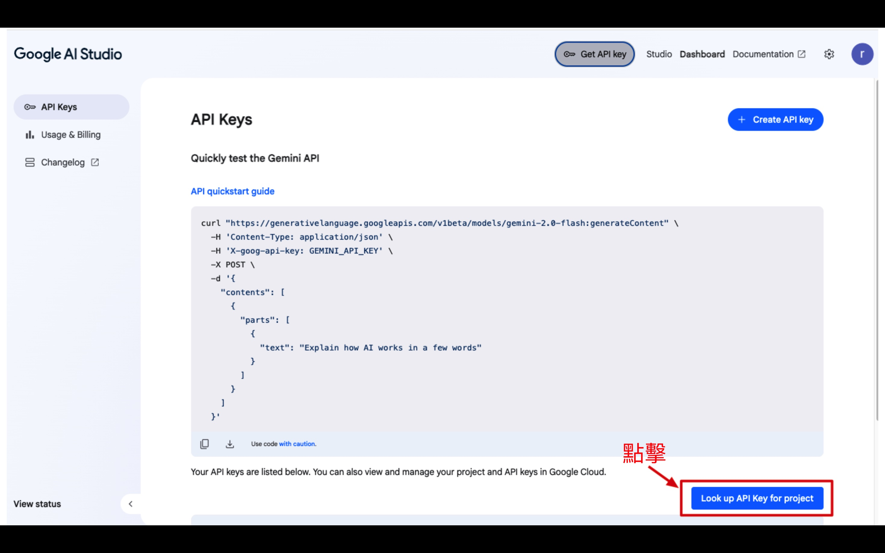
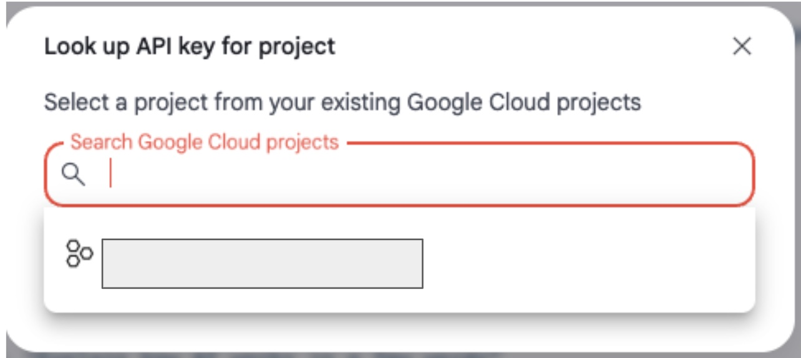
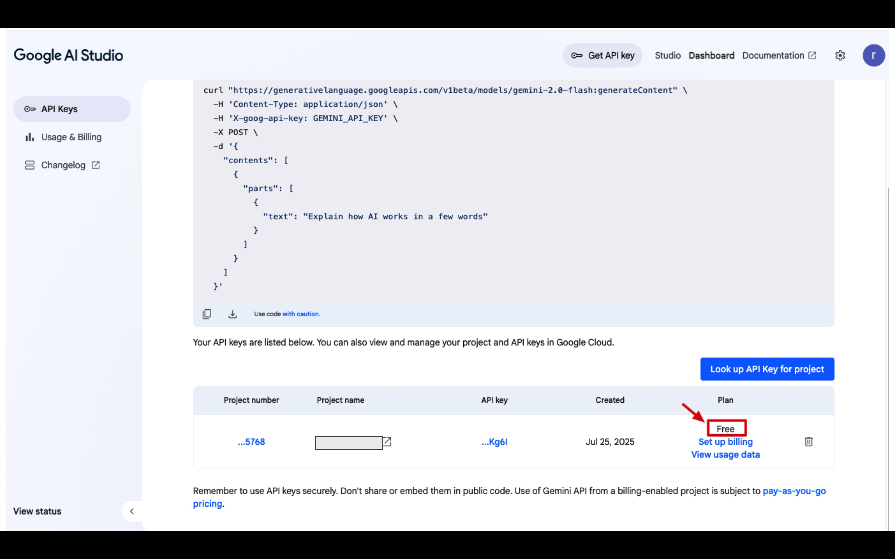
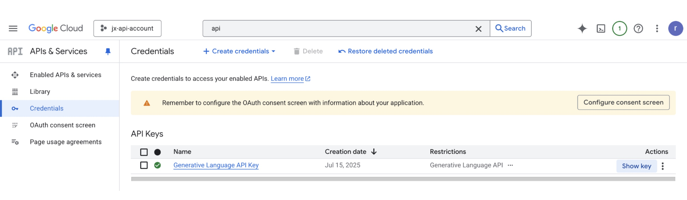
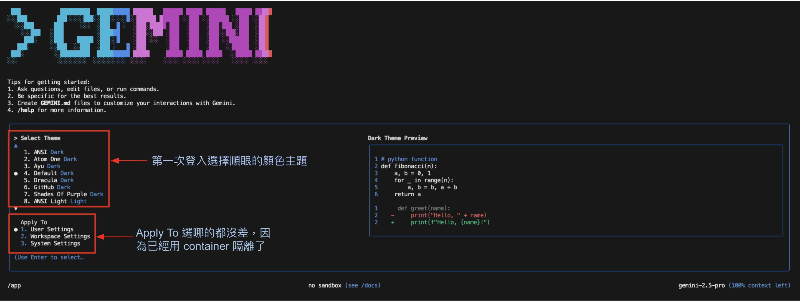
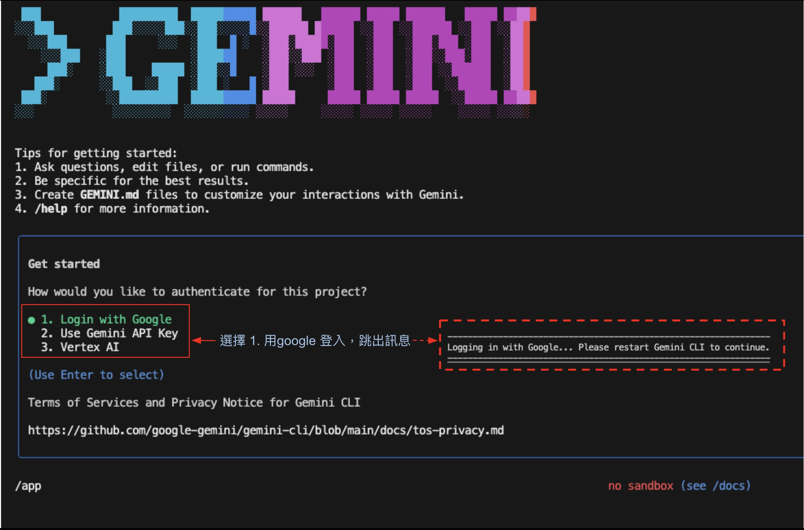
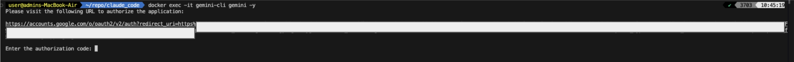
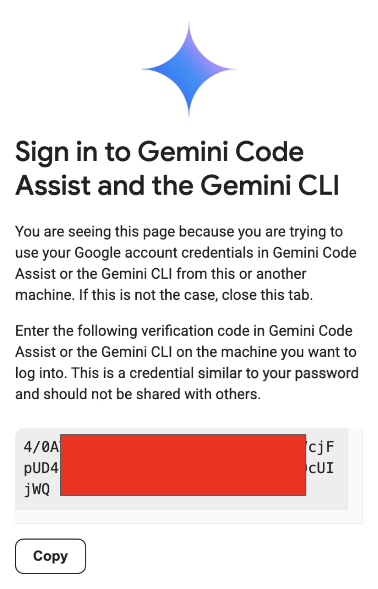

# How to use
將 code 放到 /app 目錄內，或是空目錄也可以，讓 AI Agent 的產出存到 /app

用 docker container 啟動 AI Agent，並掛載本地的的目錄 /app 到 container 內的 /app，實現環境隔離避免污染字的的作業系統

### 啟動指令直接輸入下列指令
```
docker compose up -d --build
```

### 停用/刪除，docker container
```
docker compose down
```

### 進入 AI Agent 對談視窗
```
docker exec -it gemini-cli gemini -y
```


---

# 初次使用
用 google 帳號登入 Google AI Studio\
https://aistudio.google.com/app/apikey

點擊 Get API Key



# 取得 API key
此步驟選擇一個 GCP 專案，會在專案內產生API key


# GCP Project
如果還沒有 GCP Project\
先進 GCP Console建立一個：\
https://console.cloud.google.com/


只要 GCP Project 不綁信用卡就不用擔心被收費。
付費訂閱會有更強的功能。\
定價說明文件：https://ai.google.dev/gemini-api/docs/pricing?hl=zh-tw


# 可進入 GCP Project 確認自己的 API keys
APIs & Services ⭢ Credentials \
可以看到 Google AI Studio 產出的 API keys \
不需進行其他操作


# 初次使用 gemini cli 進行設定


# 選擇登入方式，選完會跳出 Please restart Gemini CLI to continue. 



# 再次使用 docker 指令 進入 gemini，並驗證使用 URL、瀏覽器進行驗證

```
docker exec -it gemini-cli gemini -y
```


點擊 URL 開啟瀏覽器進行驗證



# 取得驗證碼
按下 Copy 將驗證碼複製並貼到 terminal



# 登入成功
進入 AI Agent 對談視窗


